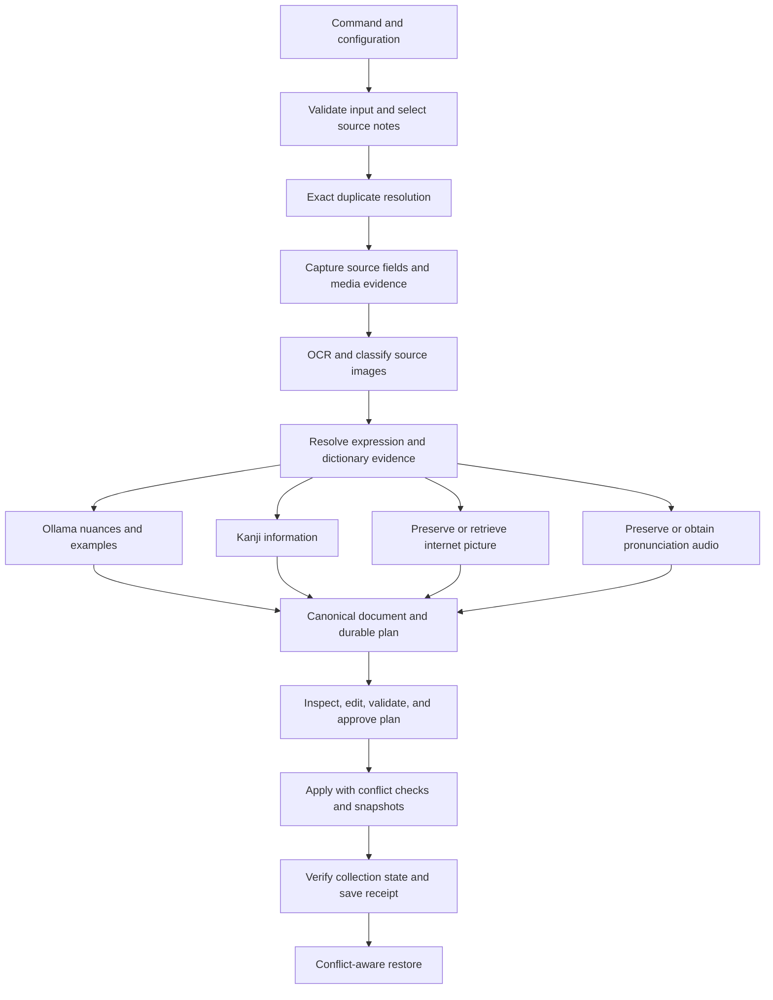

# Application specification reference

## 4. End-to-end workflow and dependency order

**REQUIRED invariants:** selection and enrichment do not mutate Anki; dictionaries own definitions and readings; OCR is evidence, not an authoritative replacement for definitions; LLM vocabulary output owns only nuances/examples; user edits remain distinguishable; uncertain pictures are preserved; every mutation has durable recovery evidence; previewed and applied values must agree.

After dictionary resolution, generation, Kanji, new-image search, and audio work may run concurrently with bounded service limits. Existing-image OCR must finish before generation that depends on it. A user's edit to expression, dictionary sense, context, prompt, voice, or image policy invalidates the affected downstream stages rather than every stage indiscriminately.
